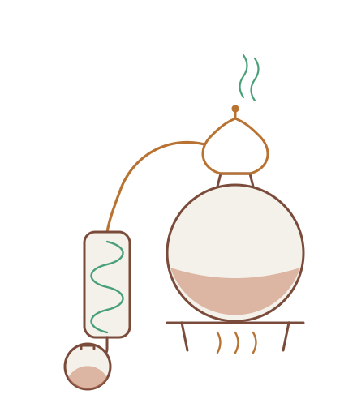
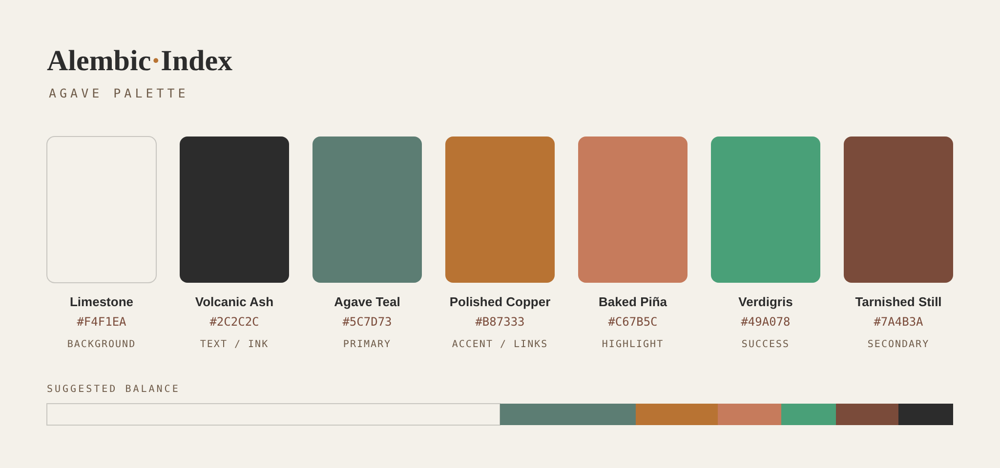

<p align="center">
  <a href="https://alambique.uihub.app/">
    <picture>
      <source media="(prefers-color-scheme: dark)" srcset="./assets/logo-card.svg">
      
    </picture>
  </a>
</p>

<p align="center">
  <strong>A local, private RAG over your own reference library.</strong><br>
  Ask your notes, books, and papers anything — get <strong>cited</strong> answers, running
  <strong>entirely on your own hardware</strong> with nothing exposed to the internet.<br>
  <sub>Works over Markdown / iA Writer notes, EPUBs, and academic PDFs.</sub>
</p>

<p align="center">
  <a href="./LICENSE"></a>
  
  
  <a href="https://alambique.uihub.app/"></a>
</p>

<p align="center">
  <a href="https://alambique.uihub.app/"></a>
</p>

> **Privacy invariants.** Models run on `localhost`; the container publishes no ports; PDF
> parsing is 100% local (PyMuPDF — **never** a cloud parser); the vector database is touched
> only from inside the container. After first setup, the whole thing works with the network off.

Alambique Index started as a **proof-of-concept on a single Apple Silicon Mac** (developed on an
M-series MacBook Pro with 48 GB of unified memory). It is built to move to a **self-hosted Docker
server** later with no code changes — see [Roadmap](#roadmap--self-hosted-migration).

---

## Why

Cloud RAG tools want you to upload your library. This one doesn't. Your notes and books never
leave the machine: local embeddings, a local vector store, a local LLM, and a local web console.
The trade-off you're making — privacy and control in exchange for running your own inference — is
the whole point.

It also does the unglamorous parsing work properly: fence-aware Markdown chunking, two-column
academic-PDF handling with header/footer stripping, EPUB spine walking, and automatic local OCR
for scanned pages — so citations point at real passages instead of garbled text.

---

## What it looks like

**Landing page — [alambique.uihub.app](https://alambique.uihub.app/).** A plain-language tour of how
local RAG works, ending in two live, interactive demos built entirely in client-side JS: the
**Prompt Tracer**, a narrated walk-through of retrieval against a real embedded corpus with a
CRT-terminal readout of each stage, and the **Prompt Lab**, where you ask a demo library anything and
watch hybrid retrieval re-rank the passages in real time as you slide keyword against meaning, flip
the reranker, or change how many results survive.

**The console** (`http://localhost:8000`) is a conversation-first research assistant — streaming
answers with inline `[n]` citations, a click-through source inspector, corpus / tag / reranker
filters, drag-and-drop live ingest that animates a new document into the map, an **editable**
semantic-map Atlas, a drafting scratchpad, and a retrieval-quality dashboard fed by every query it
logs. It can also answer to Claude and other agents over a local MCP server. Fully offline,
single-file, no build step.

<p align="center">
  <br>
  <sub><em>The "Alambique Agave" palette the console and landing page share.</em></sub>
</p>

> **Add UI screenshots here.** Capture your running console (a conversation showing `[n]` citations),
> the retrieval-quality dashboard, and the live landing page, drop the PNGs into
> [`assets/`](./assets), and embed them in this section — e.g. ``.

---

## Architecture

```
 ┌──────────────────────────── host machine (native) ───────────────────────────┐
 │                                                                               │
 │   Source documents  ──(materialize_corpus.sh: download + rsync)──►  ./.staging
 │   • Markdown / iA Writer .md    (handles cloud-synced "dataless"      (corpus,
 │   • .pdf  • .epub                placeholders; copies only md/pdf/epub) read-only)
 │                                                                               │
 │   Ollama (native, GPU-accelerated)                                            │
 │   • bge-m3            (embeddings)        :11434                               │
 │   • qwen3:30b-a3b     (generation)                                            │
 └───────────────▲───────────────────────────────────────────────▲──────────────┘
                 │ host.docker.internal:11434                     │  ./.staging
                 │ (HTTP, localhost)                              │  → /corpus :ro
 ┌───────────────┴──────────────────── container ────────────────┴──────────────┐
 │  alambique-index image  (one image, three entrypoints)                          │
 │                                                                               │
 │   ingest:  walk /corpus → parse (md/epub/pdf) → chunk → embed → store         │
 │   ask:     retrieve (BM25 + vector) → generate → answer + citations           │
 │   api:     the same core behind a localhost web console + JSON API            │
 │                                                                               │
 │   Chroma (embedded)  ──►  named volume  → /data/chroma                        │
 │                          (lives in the Linux VM; never a host bind mount)     │
 └───────────────────────────────────────────────────────────────────────────────┘
```

The host does exactly two things: **run native inference** (Ollama) and **materialize the
corpus**. Everything else runs in the container. Migrating to another Docker host requires only
re-pointing the model endpoint and the corpus mount.

---

## Prerequisites

1. **[Ollama](https://ollama.com)** running natively, with the two models pulled:
   ```bash
   ollama serve            # if not already running
   ollama pull bge-m3
   ollama pull qwen3:30b-a3b
   ollama list             # confirm both appear
   ```
   Both models are swappable in `config.yaml`. `qwen3:30b-a3b` is a mixture-of-experts model
   that runs comfortably in ~24–32 GB of RAM; pick a smaller generation model if you have less.
2. **Docker** — [OrbStack](https://orbstack.dev) or Docker Desktop — for the container path.
3. *(Optional, host-direct dev path only)* Python 3.10+ and a virtualenv.

---

## Configuration

Everything lives in a single [`config.yaml`](./config.yaml) — corpus paths, chunk size/overlap,
models, retrieval knobs, reranker, OCR, and the vector-store location. **No code edits are needed
to tune any of it.** Point the corpus sources at wherever your documents live:

```yaml
corpus:
  ia_writer:                                # your Markdown / iA Writer notes
    source: "/path/to/your/notes"           # host path this machine can read (edit me)
    mount:  "/corpus/ia_writer"             # read-only mount inside the container
    include: ["**/*.md", "**/*.markdown"]
    exclude: ["Templates/**", "Archive/**"] # folders to skip
  books_papers:                             # your books + papers
    source: "/path/to/your/library"
    mount:  "/corpus/books_papers"
    include: ["**/*.pdf", "**/*.epub"]
    exclude: []
  uploads:                                  # files added LIVE from the console (+ Add)
    mount:  "/corpus/uploads"               # NB: no `source:` — materialize skips it so it
    include: ["**/*.pdf", "**/*.epub", "**/*.md", "**/*.markdown"]  # never wipes uploads
    exclude: []

embedding:
  model: bge-m3                             # changing this forces a full re-embed
  base_url: "http://host.docker.internal:11434"

generation:
  model: "qwen3:30b-a3b"
  base_url: "http://host.docker.internal:11434"

retrieval:
  top_k: 6
  hybrid: true              # BM25 + vector fusion
  over_fetch: 3             # fetch top_k*over_fetch candidates, then trim
  max_per_doc: 2            # cap chunks from any single document
  filter_extraction: true   # infer corpus/doc_type filters from phrasing; explicit filters always win
  rerank: "bge"             # "off" | "bge" | "llm"

vector_store:
  type: chroma          # chroma (local) | qdrant (server)

logging:
  queries: true          # log every ask/stream to a local SQLite DB; powers the /dashboard.
                          # strictly observational — never influences ranking. kill switch: false

uploads:
  max_mb: 100            # reject larger live uploads (guards the parser + memory)

ingest:
  isolate_parse_timeout: 300  # parse each PDF/EPUB in a child process; a crash/hang skips just
                              # that file instead of killing the whole run. 0 = parse in-process
```

Split your corpus into as many named collections as you like — the web console can scope queries
to or away from any of them (handy for keeping, say, recipes out of your research answers).

> **Cloud-synced files.** If your documents live in a sync folder that keeps "dataless"
> placeholders on disk (iCloud Drive, etc.), `scripts/materialize_corpus.sh` force-downloads and
> verifies them before ingest, and the live sync path is never mounted. If your files are already
> fully local, you can copy them into `./.staging` yourself and skip that step.

---

## Quickstart (Docker — the portable path)

```bash
git clone https://github.com/Corb3t/alambique-index.git
cd alambique-index

# 1. Materialize the corpus into ./.staging (downloads any cloud placeholders)
./scripts/materialize_corpus.sh

# 2. Build the image
docker compose build

# 3. Ingest (incremental; re-runs skip unchanged files). --force re-embeds all.
docker compose run --rm ingest
docker compose run --rm ingest --force

# 4. Ask, with citations
docker compose run --rm ask "What do my notes say about chunking strategy?"
docker compose run --rm ask --show-context "Which paper introduced scaling laws?"
```

Example output:

```
=== ANSWER ===
Your corpus chunks Markdown notes on `##` boundaries and sub-splits long
sections with overlap [1], while PDFs are split per page after stripping
headers/footers [2].

=== SOURCES ===
  [1] Local RAG Notes — ## Retrieval   (note.md)        (score 0.81)
  [2] Attention Is All You Need — p. 3   (attention.pdf)  (score 0.64)
```

Web console + API: `docker compose up api` → open `http://localhost:8000`.
See [Web console + API](#web-console--api).

---

## Run as a native app (no Docker)

The fastest, most app-like way to use it day to day. It runs natively (no container), so the index
lives in a plain `./.data` folder you can copy and back up, nothing ever rebuilds, and once set up
it works **fully offline**.

**One-time (optional):** bring an existing Docker index over so you don't re-ingest:

```bash
./scripts/migrate_index_from_docker.sh
```

**Daily use:** double-click **`Alambique-Index.command`** (drag it to your Dock for one-click launch).
It self-installs a virtualenv on first run, ensures Ollama is up, starts the console, and opens
`http://localhost:8000`. Close the window to stop. After setup it's fully offline — local models,
local index, local GUI.

**Add or change documents:** double-click **`Update-Index.command`** — it materializes the corpus
and re-ingests (incremental; only changed files re-embed).

**Sharper reranking on the local GPU:** host-direct, the BGE reranker uses the Mac GPU (Metal/MPS) —
much faster than in-container. Enable it once, then pick `bge` in the Rerank filter:

```bash
./.venv/bin/pip install -r requirements-rerank.txt
```

Requires Python 3.10+ and the two models pulled. The Docker path above stays for the eventual
server migration.

For the CLI host-direct: `source .venv/bin/activate` then `python -m alambique_index.ask "…"` with the
`OLLAMA_BASE_URL` and index-path environment variables the launcher sets.

---

## How it works

**Parsing & chunking** (`alambique_index/parsers/`, framework-agnostic and unit-tested):

- **Markdown / iA Writer** — reads YAML frontmatter (`title`, `date`, `tags`), captures the H1
  title, and chunks on `##` boundaries. Heading detection is fence-aware (a `##` inside a code
  fence is not a boundary). Trivially short sections merge into their neighbour; every chunk
  carries `title` + `heading` + `tags` + `date` for precise citation.
- **EPUB** — walks the spine in reading order, extracts clean chapter text, and carries book title,
  author, and chapter title.
- **PDF (local only)** — PyMuPDF with explicit logic to (1) strip repeating headers/footers and
  bare page numbers in the margin bands, (2) detect two columns and read the whole left column
  before the right, and (3) drop the trailing references section. pdfplumber is a fallback for
  near-empty pages. Image-only pages (scanned papers, vintage manuals) are **OCR'd locally and
  automatically** — `ocrmypdf` + Tesseract add a text layer, the result is cached by file hash so
  re-ingest never re-OCRs, and those chunks are tagged `ocr: true` so a citation can warn you to
  verify. Set `pdf.ocr: off` to disable; anything that still can't be read is recorded as a
  `needs_ocr` backlog (surfaced in `/health`).

**Embedding & storage** (`ingest.py`) — sections are sub-split with `SentenceSplitter`
(size/overlap from config), embedded via native Ollama (`bge-m3`), and stored in embedded Chroma
on a named volume. Idempotent: a SHA-1 manifest skips unchanged files, replaces changed ones, and
prunes deleted ones (`--force` re-embeds everything). Identical files at different paths are
content-hash de-duplicated so copies aren't embedded twice.

**Retrieval & answering** (`retrieve.py`, `ask.py`) — hybrid retrieval fuses BM25 keyword search
with dense vectors (LlamaIndex `QueryFusionRetriever`). It **over-fetches** a larger candidate
pool, then trims with a **per-document cap** (so no single file dominates) plus an optional relative
score floor; an optional reranker reorders the pool first — **BGE-Reranker-v2-m3** (local
cross-encoder, sharpest) or the LLM. The answer is generated by `qwen3:30b-a3b` from a grounded
prompt that uses only the retrieved context and cites sources as `[n]`. Answers **stream**
token-by-token, and **follow-ups are condensed against the conversation** so "and the clay-pot one?"
resolves to a standalone search query.

**Retrieval metadata** — stored chunk text is the *raw* source (so a UI can highlight the exact
passage in the original via text search), while `title`/`heading` ride in metadata and are injected
into the embedding for context. YAML tags become filterable `tag_<slug>` keys, and every chunk
carries a precise locator (`p. 4`, `## Setup`, `Chapter: …`, EPUB `href`) plus the source path.

---

## Web console + API

`docker compose up api` (or the native launcher) serves a **localhost web console** and its JSON
API on `127.0.0.1:8000` — host loopback only, nothing public. Open `http://localhost:8000`.

The console is a conversation-first research assistant:

- **Conversation thread** with streaming answers and inline `[n]` citations; follow-ups carry
  context. Click a citation or source to open the **inspector**, which loads the original and
  highlights the retrieved passage. Every finished answer gets ▲/▼ feedback buttons.
- **Filters**: corpus, doc-type, tag chips, top-k, per-doc cap, and reranker (`bge`/`llm`) — or let
  phrasing set them for you (see [Filter extraction](#filter-extraction) below).
- **Status** popover: store status, per-corpus counts, last indexed, OCR backlog.
- **Live ingest**: drop a file (or clip a web page) into the console and watch it get parsed,
  chunked, embedded, and fly into the map in real time — see [Live ingest](#live-ingest--watch-a-document-land).
- **Atlas**: a 2-D semantic map of the corpus (UMAP/PCA over the chunk embeddings, KMeans-colored,
  c-TF-IDF cluster labels) — now **editable**: box-select chunks and delete them with undo, see
  [Editable Atlas](#editable-atlas--prune-the-map).
- **Scratchpad**: pin answers and passages, edit into a draft, export Markdown.
- Fully self-hosted fonts and assets — **no CDN, no build step, works offline.**

Every ask/stream is logged to a local SQLite query log that feeds a full **retrieval-quality
dashboard** at `/dashboard` — see [Measuring retrieval quality](#measuring-retrieval-quality).

JSON API:

```bash
curl localhost:8000/health           # store status, ingest stats, OCR backlog
curl localhost:8000/facets           # corpora / tags / doc_types for the filters
curl -s localhost:8000/ask        -H 'content-type: application/json' -d '{"question":"…","corpus":"books_papers","top_k":6}'
curl -s localhost:8000/ask/stream -H 'content-type: application/json' -d '{"question":"…","history":[],"rerank":"bge"}'
curl -X POST localhost:8000/feedback -H 'content-type: application/json' -d '{"query_id":"…","verdict":"up"}'
curl localhost:8000/metrics/summary  # citation rate, never-surfaced docs, stage funnel, latency
curl -F 'file=@paper.pdf' localhost:8000/ingest/upload  # live-ingest a file into the uploads corpus
```

`POST /ask` returns `{answer, sources[], query_id, inferred_filters}`; `POST /ask/stream` streams
NDJSON events (`condensed` → `filters?` → `sources` → `token…` → `done` — `done` carries the
`query_id` used to submit `/feedback`). Both accept `tags`, `corpus`, `doc_type`, `top_k`,
`max_per_doc`, `rerank`, and `history`. `GET /source` serves a document for the inspector
(path-constrained to the corpus). `GET /metrics/summary | /metrics/docs | /metrics/funnel |
/metrics/latency | /metrics/recent` back the dashboard. `POST /ingest/upload` +
`POST /ingest/stream` + `GET /ingest/uploads` power live ingest; `POST /chunk/delete` +
`POST /chunk/restore` back the editable Atlas. Interactive docs at `/docs`.

### Live ingest — watch a document land

You don't have to leave the console to add to your library. The **`+ Add`** panel takes a file —
Markdown, PDF, or EPUB — and ingests it **live**: it's parsed, chunked, and embedded exactly like a
normal ingest run, then the new chunks **animate into the Atlas** as glowing points settling among
their nearest neighbours, so you can literally see where a document lands in your knowledge space
before the upload panel even closes. It streams the journey as NDJSON (`POST /ingest/upload` saves
the file, `POST /ingest/stream` emits parse → chunk → embed → *landing* events with each new chunk's
map coordinates and closest existing neighbours), and it's idempotent — re-adding the same file
updates in place rather than duplicating.

Uploaded files live in their own **`uploads` corpus** (see [Configuration](#configuration)). That
collection deliberately has **no `source:`** — there's nothing in a sync folder to mirror, so
`materialize_corpus.sh` skips it and never clobbers what you've added by hand. Because it's a normal
corpus, uploads persist, re-ingest with everything else, and get their own colour on the map. Nothing
about this touches the network: the file is read locally, embedded by your local model, and stored in
your local vector DB.

**Clip a web page.** A small **web-capture bookmarklet** grabs the readable text of the page you're
on and hands it to the console via `postMessage` — the console shows a confirmation card, then runs it
through the very same `POST /ingest/upload` path. The bookmarklet opens **no CORS holes** and sends
nothing anywhere but your own localhost console; you confirm every capture before it's ingested.

### Editable Atlas — prune the map

The Atlas isn't just a read-only picture anymore. Flip on **Select** mode, **box-select** a cluster
of points, and **delete** those chunks straight from the map — useful for pulling a noisy document,
an accidental duplicate, or a stray OCR-garbled page out of retrieval without re-running an ingest.
Every delete drops into a **session undo** buffer (LIFO), so a mis-drag is one click — or one toast —
away from being restored, vectors and metadata intact.

It's lossless and honest about durability: deletes are backed by `POST /chunk/delete` /
`POST /chunk/restore`, which export each affected record's **raw metadata and its verbatim embedding
vector** before removal (so a restore re-inserts the exact same point, not a re-embed) and prune the
node IDs from the ingest manifest so they won't silently reappear. Deletions are **durable until you
re-ingest the source document** — the map is a view over your library, so re-adding a file brings its
chunks back by design.

### Filter extraction

When no explicit filter is set, conservative phrasing rules infer one from the question —
"my notes on…" scopes to a Markdown/notes corpus, "the paper that…" to PDFs, "…recipe" to a
`cooking`-tagged corpus if you have one. Explicit filters always win, and the console shows an
"↳ scoped to: … auto" line when it fires. Turn it off with `retrieval.filter_extraction: false`.

---

## Use it from Claude (MCP server)

The same retrieval core is exposed as a local [Model Context Protocol](https://modelcontextprotocol.io)
server, so Claude — Desktop, Code, or Cowork — and any other MCP client can query your library
directly. It runs **in-process over stdio**: the client spawns the module, which imports the package
and calls the same `ask` / retrieval path the CLI and web console use. Nothing is published, no port
is opened, and the corpus never leaves local hardware — the same privacy posture as everything else
here. It works whether or not the web app is running.

```bash
pip install -r requirements-mcp.txt      # adds the `mcp` SDK (optional extra)
python -m alambique_index.mcp_server      # manual run; normally the client launches it
```

Tools exposed to the agent:

- **`ask(question, corpus?, doc_type?, tags?, top_k?)`** — grounded answer with inline `[n]`
  citations and a numbered source list. Runs the full hybrid-retrieval + generation pipeline.
- **`search(query, corpus?, doc_type?, tags?, k?)`** — retrieval only, no generation: ranked
  passages with scores and provenance. Faster, and never spins the generation model.
- **`list_facets()`** — the valid `corpus` / `doc_type` / `tag` values, so the agent can scope a
  query without guessing.

Wire it into a client by adding an entry to its MCP config (e.g. Claude Desktop's
`claude_desktop_config.json` under `mcpServers`, or `claude mcp add` for Claude Code):

```jsonc
{
  "mcpServers": {
    "alambique": {
      "command": "python",
      "args": ["-m", "alambique_index.mcp_server"],
      "env": { "CORPUS_RAG_CONFIG": "/abs/path/to/Alambique-Index/config.yaml" }
    }
  }
}
```

Point `command` at the interpreter that has the project installed (e.g. the repo's
`.venv/bin/python`), and set `CORPUS_RAG_CONFIG` so the server finds your `config.yaml` regardless of
the client's working directory. Since generation is local, `ask` needs Ollama running with your
models pulled; a connection failure comes back as an actionable hint, and `search` / `list_facets`
work without the generation model at all.

---

## Measuring retrieval quality

Retrieval quality is measurable, not vibes-based — both pieces below are strictly local and
strictly observational; neither ever influences ranking.

**Query log + dashboard.** Every ask/stream is logged to a local SQLite DB next to the vector
store: the question, retrieval params, the fused pool and final context per query, which chunks
the answer actually cited (parsed from the `[n]` brackets), and per-stage latency. Kill switch:
`logging.queries: false` or `CORPUS_RAG_QLOG=0`. Open `http://localhost:8000/dashboard` for:

- **Citation rate per document** — of the times a chunk reached the final context, how often the
  answer actually cited it. Retrieved-but-never-cited is a signal that a document is noise.
- **Never-surfaced documents** — indexed files that have never appeared in a fused pool, meaning
  their chunking or ingest needs work.
- **Stage funnel** — where candidates die: vector/BM25 → fused (RRF) → final → cited.
- **Latency by day**, split retrieve vs. generate.
- **Recent queries** with the ▲/▼ feedback already collected in the console — thumbed-down
  queries are the best source of new eval cases.

**Eval harness.** A golden set of question → expected-source cases (`tests/eval/golden.yaml`,
seeded from your own corpus and grown from thumbed-down queries) is scored against the live
index. It's retrieval-only, so a full run takes seconds:

```bash
./scripts/eval.sh                    # host-direct index: venv + env handled for you
./scripts/eval.sh --json report.json # keep the full report
# or by hand, with the right venv + env for your run mode:
python -m alambique_index.evaluation
```

Per case: hit@k on the fused pool, hit@k on the final context, and MRR. The run exits nonzero
when `thresholds.hit_rate_final` is missed — run it before and after any change to chunking,
reranker, `top_k`, or the embedding model.

---

## Tests

The hard parsing/chunking logic is proven on synthetic samples that bake in the tricky cases (a `##`
inside a code fence, a tiny section to merge, a two-column PDF with a running header, page-number
footers, and a references section):

```bash
pip install -r requirements.txt pytest   # full stack (API + smoke tests need it)
python tests/make_samples.py             # regenerate synthetic samples
python -m pytest tests/ -q               # parsers, walk, OCR, API, streaming, per-doc cap, query
                                          #   log, filter extraction, eval metrics, MCP tools,
                                          #   live single-file ingest, chunk delete/restore
python tests/test_parsers.py             # human-readable dump of real chunk output
python tests/smoke_pipeline.py           # full ingest→retrieve→answer with mock models
```

The parser/walk/OCR tests need only the light parsing deps; the API and smoke tests exercise the
real LlamaIndex + Chroma path with **mock models** (no Ollama), so the integration is validated end
to end without any GPU.

---

## Gotchas handled

- **Cloud-synced "dataless" files** — `materialize_corpus.sh` force-downloads placeholders and
  verifies byte counts before anything is ingested; the live sync path is never mounted.
- **macOS ↔ Linux SQLite locking** — the Chroma DB lives on a Docker **named volume**, touched only
  from inside the container. (Put it on a host bind mount and you'll hit `unlink`/lock errors —
  which is exactly why it isn't there.)
- **GPU can't pass through to Linux containers** — inference stays native on the host; the container
  calls it over `host.docker.internal`.
- **Re-index cost** — changing the embedding model forces a full re-embed; the model is an explicit,
  logged config choice, not an implicit default.
- **Scanned / image-only PDFs** — auto-OCR'd locally (ocrmypdf + Tesseract), cached by file hash and
  tagged `ocr: true`; pages that still can't be read become a `needs_ocr` backlog (visible in
  `/health`) instead of a silent gap.

---

## Roadmap — self-hosted migration

> Not built yet. The proof-of-concept is deliberately kept free of all of the below.

- **Move the stack to a self-hosted Docker server** (a home Linux box or NAS running Docker). Same
  `docker-compose.yml`; add server-appropriate volume paths then. The corpus bind mount and the
  vector-store named volume are the only host-specific bits to re-target.
- **Inference endpoint becomes a config value.** Today's `host.docker.internal:11434` becomes a
  configurable model URL — host Ollama on the server, a dedicated model container, or a remote model
  host. Already overridable via `OLLAMA_BASE_URL`.
- **Vector store.** Keep embedded Chroma if it holds up; swap to **Qdrant** (server) only if scale
  or metadata filtering demands it. The store is exportable/re-ingestable, so the switch is a
  re-ingest, not a rewrite.
- **Private ingress — keep it non-public.** Simplest for a personal tool: serve the API/UI over a
  **private mesh VPN** (e.g. Tailscale) so nothing is exposed publicly at all. Or put a
  **zero-trust tunnel with authentication** (e.g. Cloudflare Tunnel + Access) in front of the API
  hostname. Either way, no public reverse proxy is required.

---

## Repo layout

```
config.yaml               single control file — everything swappable without code edits
docker-compose.yml        one image, three entrypoints (ingest | ask | api)
Dockerfile                + Tesseract/ocrmypdf for OCR; optional BGE reranker (INSTALL_RERANK)
requirements.txt          pinned; regenerate from requirements.in
requirements-rerank.txt   optional: BGE cross-encoder reranker (torch)
requirements-atlas.txt    optional: UMAP for the semantic map
requirements-mcp.txt      optional: MCP SDK (expose the library to Claude / MCP clients)
Alambique-Index.command     native launcher (self-installing venv → serves the console)
Update-Index.command      native re-ingest launcher
scripts/
  materialize_corpus.sh   host: sync-folder → ./.staging (reads corpora + excludes from config)
  migrate_index_from_docker.sh   copy an existing Docker index → ./.data (no re-ingest)
  atlas_sample.py         export a privacy-stripped sample of the semantic map
  eval.sh                 run the retrieval eval against the host-direct index (venv + env set)
alambique_index/
  config.py               typed access to config.yaml (+ env overrides, tag slugs)
  walk.py                 corpus file walking (include/exclude) — unit-tested
  parsers/                markdown_ia.py · epub.py · pdf.py — unit-tested
  safe_parse.py           parse each PDF/EPUB in an isolated child process (crash-proof ingest)
  ocr.py                  local ocrmypdf/Tesseract, cached by file hash
  manifest.py             SHA-1 idempotency + per-file needs_ocr backlog
  store.py                pluggable vector store (Chroma | Qdrant); export/import for lossless delete
  models.py               embedding/chat factory (Ollama, or mock for tests)
  ingest.py               parse → chunk → embed → store (+ stats.json, tag keys)
  ingest_one.py           single-file LIVE ingest generator (streams parse→chunk→embed→map landing)
  retrieve.py             hybrid BM25 + vector + over-fetch/per-doc-cap/rerank controls
  ask.py                  query()/query_stream() core → CLI (condense, citations)
  mcp_server.py           stdio MCP server — ask/search/list_facets tools for Claude & MCP clients
  qlog.py                 local SQLite query log (stdlib-only; powers /dashboard)
  queryfilters.py         rule-based filter extraction from question phrasing (stdlib-only)
  evaluation.py           retrieval eval harness (golden set → hit@k / MRR, CLI gate)
  api.py                  localhost API + console (/ask, /ask/stream, /facets, /source, /health,
                          /dashboard, /feedback, /metrics/*, /ingest/*, /chunk/*, /atlas/*)
  atlas.py                2-D projection of the embeddings for the Atlas view
  cluster_labels.py       c-TF-IDF topic labels for the Atlas clusters
  provenance.py           corpus → folder → document → chunk tree from the ingest manifest
  web/                    the local console (single-file, offline, no build step)
                          index.html · dashboard.html · ingest.js (live upload) ·
                          observatory.js (editable Atlas) · fonts/ · img/
tests/                    make_samples · test_parsers · test_walk · test_ocr · test_api
                          · test_qlog · test_queryfilters · test_eval · test_mcp
                          · test_ingest_one · test_delete · smoke_pipeline · eval/golden.yaml
```

---

## Tech stack

Python · [LlamaIndex](https://www.llamaindex.ai) · [Chroma](https://www.trychroma.com) (pluggable to
Qdrant) · [Ollama](https://ollama.com) (`bge-m3` embeddings, `qwen3:30b-a3b` generation) ·
BM25 + dense hybrid retrieval · BGE-Reranker-v2-m3 cross-encoder · PyMuPDF / pdfplumber /
ocrmypdf + Tesseract · FastAPI · [Model Context Protocol](https://modelcontextprotocol.io) server ·
vanilla-JS web console · Docker / OrbStack.

---

## License

Released under the [MIT License](./LICENSE). Provided as-is, without warranty. You bring your own
corpus and your own models; nothing in this repo ships anyone else's copyrighted content.
